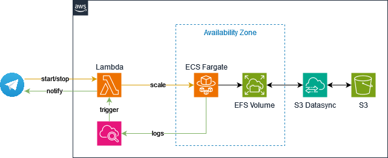

This project allows you to run as many Minecraft server instances on [AWS ECS Fargate](https://docs.aws.amazon.com/ecs/) (Elastic Container Service) as you like. You can interact with these instances using a [Telegram Chat Bot](https://telegram.org/) hosted serverless on [AWS Lambda](https://aws.amazon.com/lambda/) to start and stop your Minecraft server.

Using IaC (Infrastructure-as-code) by [Pulumi](https://pulumi.com) all you need is to run 1 command from your command line and everything is created automatically. Same goes for removal of the resources: You can remove everything by one simple command after you are done with your server.

🔥 Run as many Minecraft server instances with individual configuration as you can afford

☁️ Hosted on AWS

🤖 Start and stop your servers using a serverless Telegram Chat Bot

📂 Use S3 Datasync to interact with files in your server instance.

💰 Optionally: Use Fargate Spot instances to save up to 70% compared to regular ECS Fargate Deployment.

## Table of Contents

- [Prerequisites](#prerequisites)
- [Quickstart](#quickstart)
- [Architecture](#architecture)
- [Configuration](#configuration)

# Prerequisites

1. You have an [AWS Account](https://aws.amazon.de) available
2. Your CLI session is authorized to this AWS Account ([How-To](https://docs.aws.amazon.com/signin/latest/userguide/command-line-sign-in.html)).
3. You have installed [Pulumi](https://pulumi.com) on your machine.
4. You have cloned this git repository to your machine.
5. You have
   - [created a Telegram Bot](https://core.telegram.org/bots/tutorial) and saved it's **Bot Token**.
   - Added this bot to a Telegram Group and extracted the chat id using [GetUpdates](https://core.telegram.org/bots/api#getupdates) on the Telegram API

# Quickstart

To quickly get started with this project, follow these steps:

1. Clone the repository:

```sh
git clone https://github.com/hghtwr/minecraft-ecs-telegram.git
cd minecraft-ecs-telegram
```

2. Set the required environment variables:

```sh
export TELEGRAM_API_TOKEN=<Telegram BOT Token>
export TELEGRAM_CHAT_ID=<Telegram chat id>
```

3. Install the Pulumi dependencies:

```sh
npm install
```

4. Deploy the infrastructure using Pulumi:

```sh
pulumi up
```

After Pulumi is done with deployment, it will output the function Url of your Lambda Command Handler.
Set this as a [Webhook](https://core.telegram.org/bots/api#setwebhook) in Telegram

Now you can start and stop your Minecraft server instances using the Telegram Chat Bot hosted on AWS Lambda:

- _/start_: Scales the server instances for this service to 1. Will print the IP of the server once it's ready to accept connections.
- _/stop_: Scales the server instance to 0. Will notify you once the server is shutdown.
- _/status_: Will print the IP of the server given it's up and running.

# Configuration

Customization of your servers is possible using the stack files in the repository (Pulumi.<env>.yaml).
You need to provide a unique `awsmc:deploymentId` for each stack.

Configuration values are read from the stack file (`Pulumi.<env>.yaml`) in the `index.ts` file.
You have to use the prefix `awsmc` for the configuration keys.

> [!IMPORTANT]
> You dont necessesarily have to set any values. All of them default to reasonable values.

```yaml
config:
  aws:region: eu-central-1
  awsmc:deploymentId: "mc-ecs-dev"
  awsmc:image: "itzg/minecraft-server:stable"
  awsmc:cpu: "1024"
  awsmc:memory: "4096"
  awsmc:useSpotInstance: "true"
  awsmc:gameMode: "survival"
  awsmc:difficulty: "normal"
  awsmc:onlineMode: "false"
  awsmc:serverName: "Pulumi Minecraft Server"
  awsmc:modt: "Welcome to Pulumi Minecraft Server :)"
  awsmc:version: "1.20.2"
  [...] ## add more from the list below
```

| Attribute                  | Explanation                                                                                       |
| -------------------------- | ------------------------------------------------------------------------------------------------- |
| modt                       | Message of the Day (MOTD) displayed in the Minecraft server list                                  |
| difficulty                 | Difficulty level of the Minecraft server (e.g., "peaceful", "easy", "normal", "hard")             |
| gameMode                   | Game mode of the Minecraft server (e.g., "survival", "creative", "adventure", "spectator")        |
| onlineMode                 | Determines if the Minecraft server checks player usernames with Mojang's servers (true/false)     |
| serverName                 | Name of the Minecraft server                                                                      |
| maxPlayers                 | Maximum number of players allowed on the Minecraft server                                         |
| version                    | Version of Minecraft server to use                                                                |
| rcon                       | Remote Console (RCON) password for managing the Minecraft server                                  |
| icon                       | Path to the server icon displayed in the Minecraft server list                                    |
| maxWorldSize               | Maximum size of the Minecraft world in blocks                                                     |
| allowNether                | Determines if the Nether dimension is enabled (true/false)                                        |
| announcePlayerAchievements | Determines if player achievements are announced in chat (true/false)                              |
| enableCommandBlock         | Determines if command blocks are enabled (true/false)                                             |
| forceGameMode              | Determines if players are forced into the server's game mode (true/false)                         |
| generateStructures         | Determines if structures (e.g., villages, dungeons) are generated in the Minecraft world          |
| snooperEnabled             | Determines if server data is sent to Mojang for statistics (true/false)                           |
| maxBuildHeight             | Maximum height in blocks that can be built in the Minecraft world                                 |
| spawnAnimals               | Determines if animals spawn in the Minecraft world (true/false)                                   |
| spawnMonsters              | Determines if monsters spawn in the Minecraft world (true/false)                                  |
| spawnNpcs                  | Determines if NPCs (Non-Player Characters) spawn in the Minecraft world (true/false)              |
| viewDistance               | Maximum number of chunks that clients can see from the server (higher values require more memory) |
| levelSeed                  | Seed used to generate the Minecraft world                                                         |
| pvp                        | Determines if player versus player combat is allowed (true/false)                                 |
| levelType                  | Type of Minecraft world to generate (e.g., "default", "flat", "largeBiomes")                      |
| resourcePack               | URL or file path to a resource pack to use in the Minecraft server                                |
| resourcePackSHA1           | SHA-1 hash of the resource pack file for verification                                             |
| resourcePackEnforce        | Determines if the resource pack is enforced for all players (true/false)                          |
| level                      | Name of the Minecraft world to load                                                               |
| allowFlight                | Determines if players can fly in the Minecraft world (true/false)                                 |
| customServerProperties     | Additional custom server properties                                                               |

## Example: Create a new instance

1. Copy & Paste the `Pulumi.dev.yaml` file and rename it to `Pulumi.test.yaml`
2. Customize the values to your needs
3. Run `pulumi stack select` and create a new stack named `test`.
4. Run `pulumi up` to create a complete new and independent set of infrastructure for your servers.

## Edit server files

Most of the files can be edited by using the values described above. To fiddle around with the file system the package automatically creates [S3 Datasync](https://aws.amazon.com/datasync/?nc1=h_ls) tasks and an S3 Bucket to shift data around.
Go to S3 DataSync and use the corresponding tasks to copy data from the EFS file system to the S3 bucket and vice versa.

## RCON Usage

You can use RCON on port 25575, a password is automatically created during creation. You can find it in the environment variables of the task definition (I'm too lazy to implement AWS Secrets Manager for this right now, feel free to do so).

# Architecture



## Contributing

Feel free to open issues and PR's :)

## Acknowledgements

Big shoutout to [Minecraft Docker](https://github.com/itzg/docker-minecraft-server)

## Contact

Provide contact information for support or inquiries.
